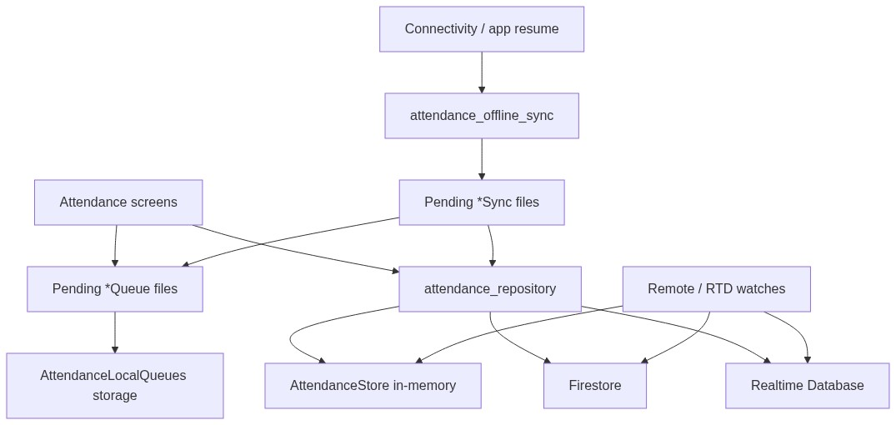

# Attendance data flow

How attendance UI, repositories, in-memory cache, Firebase backends, and offline queues connect in U-Panel.



## Components

| Node | Role |
|------|------|
| **Attendance screens** | Student check-in, roll views, pending queues, and related UI in `lib/features/attendance/`. |
| **attendance_repository** | Single entry point for Firestore/RTDB I/O; keeps `AttendanceStore` aligned with remote data. |
| **AttendanceStore** | Static in-memory cache (`lists`, `sessions`, `students`, `signIns`, `attendanceRecords`) for fast UI reads. |
| **Firestore** | Primary backend for lists, sessions, records, and check-in evidence. |
| **Realtime Database** | Live session/list watches and RTDB-backed updates. |
| **Pending *Queue files** | Local enqueue modules (check-ins, session codes, list/session creates, campus presence). |
| **AttendanceLocalQueues** | Hive-backed persistence for pending work and snapshots (`lib/core/storage/attendance_local_queues.dart`). |
| **attendance_offline_sync** | Drain orchestrator run on connectivity restore and app resume. |
| **Pending *Sync files** | Per-queue upload/reconcile workers invoked by the offline sync pipeline. |
| **Remote / RTD watches** | Listeners that merge remote changes into `AttendanceStore` (e.g. deleted lists, live session state). |

## Flow summary

1. **Reads:** Screens read from `AttendanceStore`; the repository loads and refreshes that cache from Firestore and RTDB.
2. **Writes (online):** Screens call the repository, which writes to Firebase and updates the store.
3. **Writes (offline):** Screens enqueue to pending queue modules; data is persisted in `AttendanceLocalQueues`.
4. **Sync:** When connectivity returns or the app resumes, `attendance_offline_sync` runs the pending sync workers, which drain queues through the repository.
5. **Live updates:** Remote and RTDB watchers push changes into `AttendanceStore` without a full manual reload.

## Related docs

- [Attendance read API (KIU-QAAT)](ATTENDANCE_API.md) — token scopes, export endpoint, Contabo token command.
- [U-Panel architecture catalog](U_PANEL_ARCHITECTURE.md) — broader patterns (repository, offline queues, coordinators).
- [Online check-in report](ONLINE_CHECK_IN_REPORT.md) — student check-in paths and sequence diagrams.
- [U-Panel algorithms](U_PANEL_ALGORITHMS.md) — roll stats, reconciliation, and sync ordering.

## Source diagram

The PNG is generated from [`diagrams/attendance-data-flow.mmd`](diagrams/attendance-data-flow.mmd). Regenerate after edits:

```powershell
npx --yes @mermaid-js/mermaid-cli -i docs/diagrams/attendance-data-flow.mmd -o docs/diagrams/attendance-data-flow.png -b white
```
