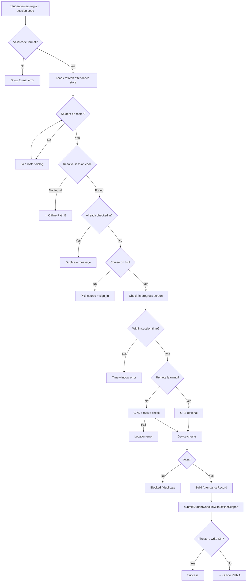
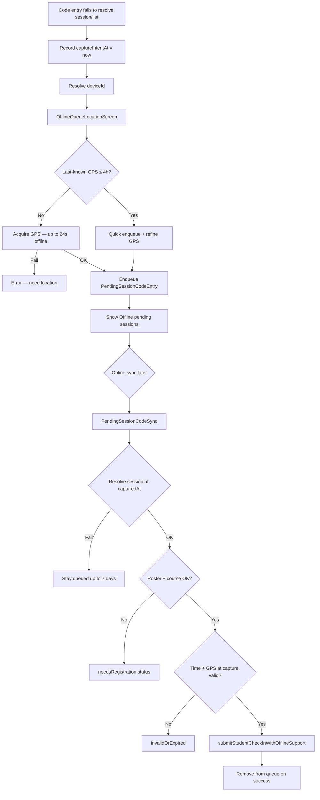
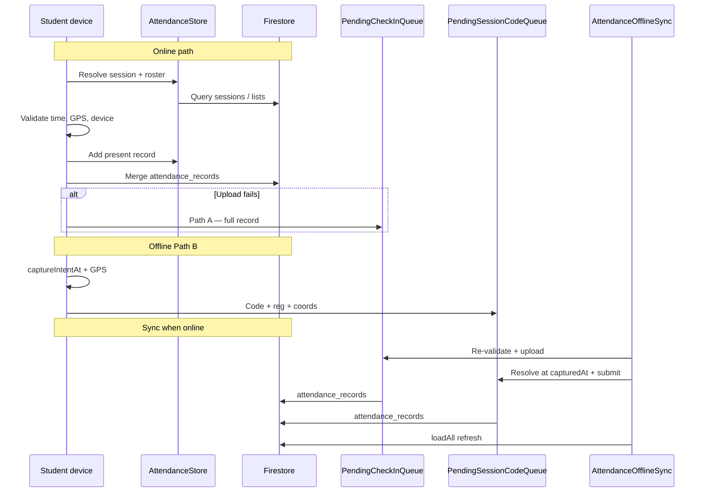

# U-Panel — Student Check-In Report (Online & Offline)

**Version 1.0.0** · Last updated: June 2026  
**Audience:** KIU staff, QA, administrators, and technical reviewers  
**App:** U-Panel (Kampala International University)

This document describes how **student attendance check-ins** work in U-Panel in both **online** and **offline** conditions: validation rules, local queues, cloud storage, device limits, and automatic sync when connectivity returns.

For end-user device requirements, see [SYSTEM_REQUIREMENTS.md](./SYSTEM_REQUIREMENTS.md). For product context, see [PROJECT_OVERVIEW.md](./PROJECT_OVERVIEW.md).

---

## 1. Executive summary

After signing in, a student checks in from the **Attendance** tab by entering their **registration number** and the **session code** shown by the lecturer. The app then validates time, location (for on-campus sessions), and device identity, and records **present** attendance in Firestore (`attendance_records`).

U-Panel supports two broad modes:

| Mode | When it applies | Result on device |
|------|-----------------|------------------|
| **Online check-in** | Session and roster resolve; validation passes; Firestore accepts the write | Present on roll locally and in the cloud immediately |
| **Offline / deferred check-in** | No network, unstable network, or cloud write fails after validation | Evidence saved **on the device** in local queues; auto-upload when sync succeeds |

There are **two offline mechanisms**:

1. **`PendingCheckInQueue`** — full attendance record already built (validation passed); only Firestore upload failed.
2. **`PendingSessionCodeQueue`** — session code or class list could not be resolved at entry time; GPS + intent time captured first, full validation runs later when online.

**Trust model:** Time and GPS checks run on the **client device**. Queued rows are **re-validated at sync** using the **original capture timestamp and coordinates**, not the sync time — so a student who checked in during class can still be credited after a delayed upload.

See also: [Student check-in flow diagram](STUDENT_CHECK_IN_FLOW.md) (PNG overview of online vs offline paths).

---

## 2. Online vs offline at a glance

| Aspect | Online path | Offline / deferred path |
|--------|-------------|-------------------------|
| **Internet needed to start?** | Yes (or cached session in store) | No — can queue with GPS only |
| **Session must resolve first?** | Yes, before check-in pipeline | No — code + GPS queued if resolve fails |
| **GPS required (on-campus)?** | Yes, fresh fix (with timeout fallback) | Yes — or last-known fix ≤ 4 hours |
| **Validation timing** | At tap / check-in now | At capture **and** again at sync |
| **Firestore write** | Immediate | When sync drains queues |
| **Student visibility** | Success banner | **Offline pending sessions** screen |
| **Retention** | Permanent in cloud | Up to **7 days** locally if never verified |
| **UI screen** | `StudentCheckInProgressScreen` | `OfflineQueueLocationScreen` + pending list |

---

## 3. Roles and entry point

| Role | Can check in? | Where |
|------|---------------|--------|
| **Student** | Yes | **Attendance** tab → registration number + session code |
| **Lecturer / QA / Admin** | No (manages sessions) | Start session, view roll |

Students sign in with university credentials (e.g. `@studmc.kiu.ac.ug`). The student sign-in flow is separate from lecturer session management.

**Offline pending list:** Attendance tab → **Offline pending sessions** (also opened automatically after some queued check-ins).

---

## 4. Session model

Each check-in targets an **`AttendanceSession`** linked to an **`AttendanceList`**.

| Field | Purpose |
|-------|---------|
| `sessionCode` | Join code (e.g. `042`) |
| `startTime` / `endTime` | Wall-clock window for valid check-in |
| `latitude` / `longitude` | Classroom center (on-campus) |
| `radiusMeters` | Allowed distance from center |
| `remoteLearning` | When `true`, GPS radius is **not** enforced |
| `status` | `active` or `closed` |
| `listId` | Links session → class list |

Active session: `status == active` **and** current time before `endTime`.

---

## 5. Prerequisites

| Requirement | On-campus | Long-distance (LDD) | Offline notes |
|-------------|-----------|---------------------|---------------|
| **Session code** | Required | Required | Queued if session not found yet |
| **Location permission** | Required | Optional | **Required** to enter session-code queue |
| **GPS fix** | Required within radius | Optional (may store 0,0) | Last-known ≤ **4 h** accepted for quick queue |
| **Device identity** | Required | Required | Required before any queue write |
| **Internet** | Needed for resolve + upload | Same | Not needed to **queue**; needed to **sync** |

---

## 6. Part A — Online check-in

### 6.1 Flow diagram



### 6.2 Session resolution (online)

1. Validate code format (`###`, legacy `####`, or `L###`).
2. Refresh **`AttendanceStore`** (Firestore cache/network).
3. Lookup order:
   - Local: `validateSessionCode(code)` → active session in store.
   - Network: `resolveSessionByCode(code)` → query `attendance_sessions`.
4. If no active session online: `resolveLatestSessionByCode` may distinguish expired vs unknown → may queue offline attempt.

### 6.3 Check-in pipeline (`StudentCheckInProgressScreen`)

| Stage | Check |
|-------|--------|
| Session active | Still `isActive` |
| Session time | `now` within `[startTime, endTime]` |
| Location | Radius check unless LDD |
| Device ID | `DeviceIdentity.resolve()` |
| Anti-sharing | One present row per device per session |
| Duplicate | Student not already present |
| Save | Submit to store + Firestore |

GPS timeouts (online): 12 s; offline-capable path uses up to 18 s. On timeout, **last-known position** may be used as fallback.

### 6.4 Record written (online success)

Document ID: `{sessionId}_{studentId}` in **`attendance_records`**.

| Field | Present check-in |
|-------|------------------|
| `present` | `true` |
| `verified` | `true` |
| `timestamp` | Check-in time |
| `latitude` / `longitude` | GPS (or 0,0 for LDD if unavailable) |
| `course` | Selected or resolved course |
| `deviceId` | Install/device identifier |

Writes use Firestore **merge** set.

### 6.5 Upload outcomes

`submitStudentCheckInWithOfflineSupport()`:

| Outcome | Meaning |
|---------|---------|
| `success` | Local + cloud saved |
| `queuedOffline` | Local saved → **`PendingCheckInQueue`** |
| `duplicate` | Already present |
| `deviceBlocked` | Device used for another student this session |

Previously **absent** rows can be **upgraded** to present on successful check-in.

---

## 7. Part B — Offline check-in

Offline check-in is not a separate student mode — it is how U-Panel **preserves intent and evidence** when the online path cannot finish. Students still enter the same code; the app branches into one of two offline paths.

### 7.1 When offline queuing is triggered

| Trigger | Path | Queue used |
|---------|------|------------|
| Session code not found (offline or flaky network) | **B** | `PendingSessionCodeQueue` |
| Session expired but code recognized online | **B** | `PendingSessionCodeQueue` |
| Class list cannot be loaded | **B** | `PendingSessionCodeQueue` |
| Course enrollment save fails after pick | **B** (if GPS captured) | `PendingSessionCodeQueue` |
| Validation passed but Firestore write failed | **A** | `PendingCheckInQueue` |
| Online check-in returns `queuedOffline` | **A** | `PendingCheckInQueue` |

Wi‑Fi may show “connected” while Firestore is unreachable — the app treats this like offline and queues when appropriate.

### 7.2 Path A — Validated check-in, upload deferred

**Scenario:** Student reached `StudentCheckInProgressScreen`, passed time/GPS/device checks, local **`AttendanceStore`** row exists, but **`tryWriteAttendanceRecordDocument`** failed.

**Stored in:** `PendingCheckInQueue` (JSON via Hive / SharedPreferences).

**Entry fields:**

| Field | Purpose |
|-------|---------|
| `id` | `{sessionId}_{studentId}` |
| `sessionId`, `studentId`, `listId` | Session linkage |
| `course` | Course unit |
| `capturedAt` | Original check-in timestamp |
| `latitude`, `longitude` | GPS at capture |
| `deviceId` | Device fingerprint |
| `pendingSince` | When queue wait started |

**Capacity:** max **200** entries (oldest dropped).

**Sync (`AttendanceOfflineSync._drainCheckInsWithoutReload`):**

1. Drop rows older than **7 days**.
2. Load session from store; if missing, **keep** row until session syncs or expiry.
3. Re-validate **`capturedAt`** against session time window.
4. Re-validate GPS against session radius (skipped for LDD).
5. Re-check device and duplicate rules.
6. Upload to Firestore; remove from queue on success.

Invalid rows (wrong time/place at capture) are **discarded** at sync — not uploaded.

### 7.3 Path B — Session-code attempt (resolve later)

**Scenario:** Student entered a valid-format code, but the app could not complete online resolution (no session, no list, or offline entirely).

**Flow:**



**Stored in:** `PendingSessionCodeQueue`.

**Entry ID pattern:** `{normalizedCode}_{REGISTRATION_NUMBER}`

**Entry fields:**

| Field | Purpose |
|-------|---------|
| `registrationNumber` | Student reg # |
| `sessionCodeRaw` | Code as entered |
| `capturedAt` | **Intent time** — recorded *before* GPS wait so slow GPS does not push past `endTime` |
| `latitude`, `longitude` | GPS evidence |
| `deviceId` | Device fingerprint |
| `status` | Processing state (see §7.5) |
| `note` | Human-readable status for student |

**GPS strategy (`OfflineQueueLocationScreen`):**

1. If last-known position ≤ **4 hours** old → enqueue immediately with note “refining GPS…”, then try fresh fix.
2. If offline and no recent fix → allow last-known up to 4 h via `acquirePositionForOfflineQueue`.
3. Online: 12 s GPS timeout; offline: up to **24 s**.
4. If refine fails but quick last-known existed → keep row with last-known coords.

**Capacity:** max **200** entries.

### 7.4 Session replay at capture time

Offline sync does **not** require the session to be “active right now”. It uses:

`resolveSessionByCodeAtTime(rawCode, capturedAt)`

This matches a session whose `[startTime, endTime]` contains **`capturedAt`**, even if the session has since ended or closed. That allows a student who checked in during class to sync successfully after the lecture.

### 7.5 Pending session-code statuses

| Status | Meaning | Student action |
|--------|---------|----------------|
| **`queued`** | Waiting for network, session sync, or stable upload | Wait; open pending screen to refresh |
| **`needsRegistration`** | Student not on roster or no course on list | Join roster / pick course online, then sync |
| **`invalidOrExpired`** | Capture time or GPS failed re-validation | Cannot be submitted; removed after retention |
| **`deviceBlocked`** | Another student used this device for the session | Use own device or contact lecturer |

### 7.6 Local storage

Queues persist in **`AttendanceLocalQueues`**:

- Primary: **Hive** box `u_panel_attendance_queues`
- Fallback: **SharedPreferences** if Hive unavailable
- Keys: `pending_attendance_check_ins`, `pending_attendance_session_codes`, sync summary JSON

Queues are cleared on **sign-out** (`clearAllPending`).

A separate local **attendance snapshot** caches lists/sessions/records for offline display; queue drain order avoids wiping the store mid-sync (which previously caused present/absent flips).

---

## 8. Sync and retention (both paths)

### 8.1 Sync worker

`AttendanceOfflineSync.drainAllInOrder()` runs when:

- App opens / shell resumes
- Connectivity restored (`AppConnectivity` listener)
- Student opens **Offline pending sessions** and taps refresh (when online)
- Periodic poll on pending screen (every 3 s from disk)

**Drain order:**

1. Purge expired rows (> **7 days**)
2. Pending lecturer **session creates** (staff-side)
3. **`PendingCheckInQueue`** (Path A)
4. **`PendingSessionCodeQueue`** (Path B)
5. **`loadAll`** from Firestore when online

Only one drain runs at a time (`_draining` guard).

### 8.2 Retention policy

| Rule | Value |
|------|--------|
| Max age for unverified pending | **7 days** (`PendingRetention.unverifiedPending`) |
| Invalid session-code rows | Marked `invalidOrExpired`; removed after marked time exceeds retention |
| Queue capacity | **200** entries per queue (FIFO trim) |

After expiry, pending rows are **deleted locally** — they are never uploaded.

---

## 9. Validation rules (online and offline)

Shared logic in `check_in_validation.dart`.

### 9.1 Time window

```text
valid ⟺ startTime ≤ timestamp ≤ endTime
```

| Context | Timestamp used |
|---------|----------------|
| Live online check-in | `DateTime.now()` |
| Path A sync | `capturedAt` on queue entry |
| Path B sync | `capturedAt` on session-code entry |

### 9.2 Location (on-campus)

```text
valid ⟺ distance(student, session center) ≤ radiusMeters
```

Skipped when `session.remoteLearning == true`.

### 9.3 Session code format

| Pattern | Example |
|---------|---------|
| 3 digits | `042` |
| 4 digits (legacy) | `7291` |
| Letter + 3 digits (legacy) | `A123` |

### 9.4 Device limit

One **present** check-in per **`deviceId`** per **session**. Blocks proxy attendance (one phone, multiple students).

| Platform | Device ID source |
|----------|------------------|
| Android | `androidInfo.id` or persisted fallback |
| iOS | `identifierForVendor` or fallback |
| Web / desktop | Per-install ID in SharedPreferences |

---

## 10. Student UI and messages

### 10.1 Screens

| Screen | Role |
|--------|------|
| `StudentCheckInProgressScreen` | Online pipeline (“Checking session time…”, “Saving attendance…”) |
| `OfflineQueueLocationScreen` | GPS capture for Path B (“Offline check-in”) |
| `PendingSessionsScreen` | Lists queued session codes, pending uploads, sync summary |

### 10.2 Common messages

| Message | Online / offline | Cause |
|---------|------------------|--------|
| “Check-in is only allowed during the scheduled session window.” | Online | Outside session times |
| “Too far from class…” | Online | Outside radius |
| “Attendance saved on this device. Will upload when you are online.” | Offline Path A | Upload queued |
| “Session saved for later verification…” | Offline Path B | Code queue |
| “Code not found right now. Your attempt is saved…” | Offline Path B | Unknown code, will retry |
| “This code looks expired now, but your attempt is saved…” | Offline Path B | Expired but queued |
| “Outside class location radius at capture time.” | Offline sync | Path B failed GPS re-check |
| “Captured outside session time window.” | Offline sync | Path B failed time re-check |
| “Sign into this class list (pick your course)…” | Offline sync | `needsRegistration` |

---

## 11. Firestore data map

| Collection | Role |
|------------|------|
| `attendance_sessions` | Session codes, times, GPS center, radius, LDD |
| `attendance_lists` | Class metadata, courses |
| `students` | Student directory |
| `sign_ins` | Student ↔ list ↔ course |
| `attendance_records` | Final present/absent per session + student |

**Not in Firestore:** raw offline queue payloads — they live only on the device until validated and merged into `attendance_records`.

---

## 12. Platform notes

| Platform | Online | Offline queue + sync |
|----------|--------|----------------------|
| **Android** | Full support | Full support; primary target |
| **Web** | HTTPS + browser location | Queues in browser storage (Hive/ prefs) |
| **Windows** | Supported | Supported |
| **iOS** | Via web / future native | Same queue model |

---

## 13. Key source files

| Area | File |
|------|------|
| Student code entry | `lib/features/attendance/attendance_screen.dart` |
| Online pipeline UI | `lib/features/attendance/student_check_in_progress_screen.dart` |
| Offline GPS queue UI | `lib/features/attendance/offline_queue_location_screen.dart` |
| Pending list UI | `lib/features/attendance/pending_sessions_screen.dart` |
| Validation | `lib/features/attendance/check_in_validation.dart` |
| Models | `lib/features/attendance/models/attendance_models.dart` |
| Firestore I/O | `lib/features/attendance/data/attendance_repository.dart` |
| Path A queue | `lib/features/attendance/data/pending_check_in_queue.dart` |
| Path B queue | `lib/features/attendance/data/pending_session_code_queue.dart` |
| Sync orchestration | `lib/features/attendance/data/attendance_offline_sync.dart` |
| Path B replay | `lib/features/attendance/data/pending_session_code_sync.dart` |
| Retention | `lib/features/attendance/data/pending_retention.dart` |
| Local queue storage | `lib/core/storage/attendance_local_queues.dart` |
| Device ID | `lib/core/device/device_identity.dart` |
| Location | `lib/core/location/location_permission.dart` |
| Connectivity | `lib/core/connectivity/app_connectivity.dart` |

---

## 14. Combined data-flow diagram



---

## 15. Related policies

- **Privacy:** Location, device ID, and local caching — [Privacy Policy](https://kiu.orion13.us/privacy.html).
- **Account deletion:** [Delete account](https://kiu.orion13.us/delete-account.html) — attendance already uploaded may be retained for academic records.

---

*This report reflects U-Panel 1.0.0 as implemented in the codebase. For operational questions, contact KIU ICT or your faculty administrator.*
