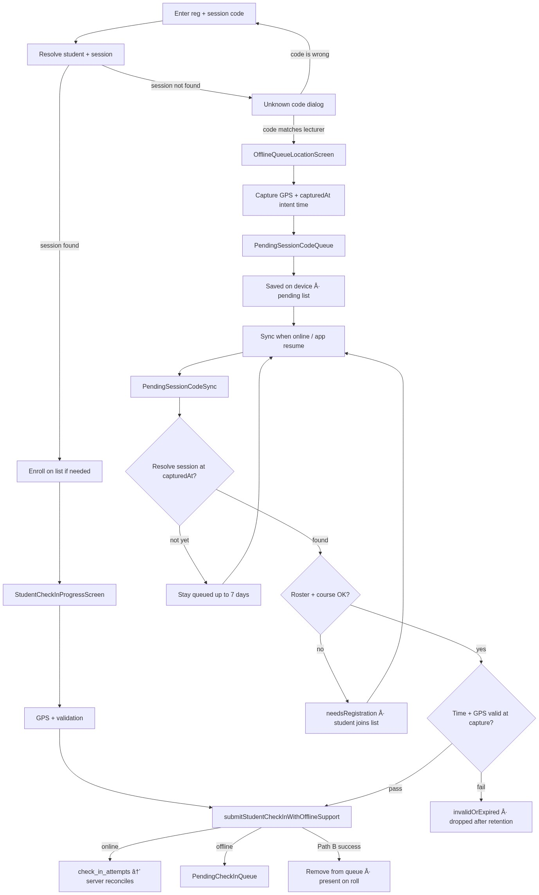

# Student check-in flow

How a student moves from entering a registration number and session code through online check-in or offline queuing (Path A and Path B).



## Path A — session found (online / offline upload)

| Step | What happens |
|------|----------------|
| **Resolve student + session** | App loads roster row and resolves the active session by code. |
| **Enroll on list if needed** | Student picks a course if not yet on the class list. |
| **StudentCheckInProgressScreen** | Online pipeline: time window, GPS, device, upload progress. |
| **submitStudentCheckInWithOfflineSupport** | Tries Firestore upload or queues locally. |
| **Online** | `check_in_attempts` → Cloud Functions → official `attendance_records`. |
| **Offline** | Full evidence in `PendingCheckInQueue` until sync. |

## Path B — session not found (deferred check-in)

| Step | What happens |
|------|----------------|
| **Unknown code dialog** | Student confirms the code matches what the lecturer showed, or goes back to re-enter. |
| **OfflineQueueLocationScreen** | Captures GPS; records **capturedAt** (intent time) *before* GPS so slow fixes do not miss the session window. |
| **PendingSessionCodeQueue** | Stores code + reg + coords + device id on device (Hive / SharedPreferences). |
| **Saved on device** | Shown on the pending-attendance screen; no official roll row yet. |
| **PendingSessionCodeSync** | Runs when connectivity returns or the app resumes (`AttendanceOfflineSync`). |
| **Resolve session at capturedAt** | Uses `resolveSessionByCodeAtTime` — session must cover the original capture time, not “now”. |
| **Stay queued** | Session not on server yet (lecturer offline / not started); retried for up to **7 days**. |
| **needsRegistration** | Student not on roster or must pick a course — fix online, then sync retries. |
| **invalidOrExpired** | Capture time or GPS failed re-validation; row removed after retention. |
| **Rejoins Path A submit** | On success, same `submitStudentCheckInWithOfflineSupport` → `check_in_attempts` → server reconciles → removed from queue. |

## Related docs

- [Online check-in report](ONLINE_CHECK_IN_REPORT.md) — Path B detail, statuses, retention, and sequence diagrams.
- [Attendance data flow](ATTENDANCE_DATA_FLOW.md) — repository, queues, and offline sync architecture.

## Regenerate image

```powershell
npx --yes @mermaid-js/mermaid-cli -i docs/diagrams/student-check-in-flow.mmd -o docs/diagrams/student-check-in-flow.png -b white
```

Or via mermaid.ink (no local install):

```powershell
$src = Get-Content docs/diagrams/student-check-in-flow.mmd -Raw
$bytes = [System.Text.Encoding]::UTF8.GetBytes($src)
$b64 = [Convert]::ToBase64String($bytes).TrimEnd('=').Replace('+','-').Replace('/','_')
Invoke-WebRequest -Uri "https://mermaid.ink/img/$b64" -OutFile docs/diagrams/student-check-in-flow.png
```
