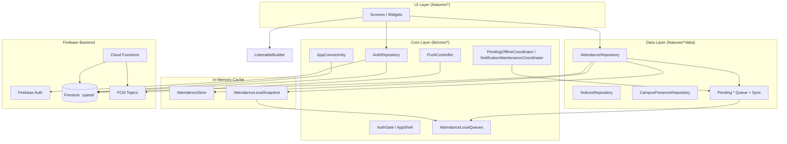
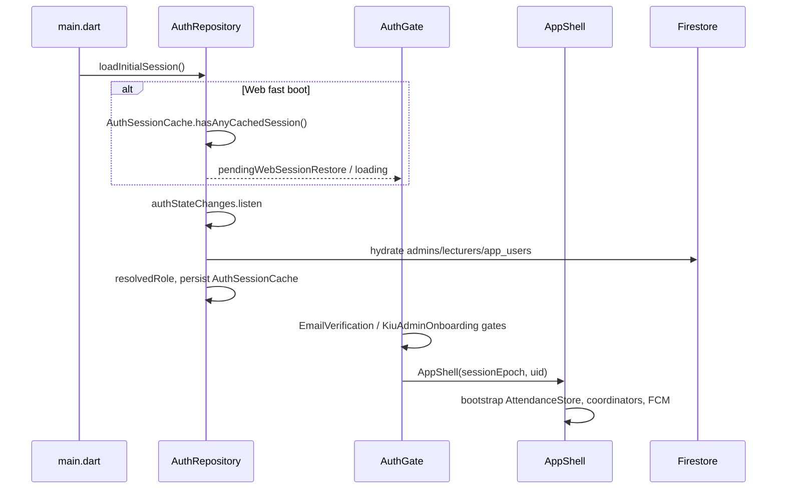
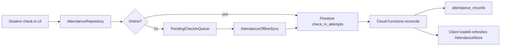

# U-Panel — Technical Architecture Catalog

This document catalogs architecture patterns, layers, and integrations found in the U-Panel Flutter project at `c:\Users\MICHAEL\Desktop\lab\U-Panel`, based on the actual `lib/` tree, `firestore.rules`, and `functions/index.js`.

---

## 1. High-Level Overview

U-Panel is a university operations app (attendance, notices, reports, campus presence) built on **Flutter + Firebase**. The codebase follows a **feature-first layout** with a shared **core** layer. State management is **not MVVM** in the strict sense; it uses **singleton `ChangeNotifier` repositories** plus **`ListenableBuilder`** in widgets, backed by a **static in-memory domain cache** (`AttendanceStore`).

---

## 2. Project Structure

### 2.1 Layer: `lib/core/` — Cross-cutting infrastructure

| Area | Path | Purpose |
|------|------|---------|
| Auth | `lib/core/auth/` | Firebase Auth, role hydration, registration helpers, session cache |
| Connectivity | `lib/core/connectivity/` | Online/offline detection, online-first write helper |
| Firebase | `lib/core/firebase/` | Named DB accessor, collection name constants |
| Navigation | `lib/core/navigation/` | Auth gate, app shell, section routing, pull-to-refresh host |
| Offline / sync orchestration | `lib/core/offline/` | Background queue drain coordinator |
| Storage | `lib/core/storage/` | Hive/SharedPreferences abstraction, snapshots, staff directory cache |
| Push / notifications | `lib/core/push/`, `lib/core/notifications/` | FCM, local notifications, Workmanager, lesson reminders |
| Location / device | `lib/core/location/`, `lib/core/device/` | GPS permission, device identity for anti-proxy check-in |
| Platform | `lib/core/platform/` | Web fast-boot optimizations |
| Widgets / theme | `lib/core/widgets/`, `lib/core/theme/` | Admin gate, loading skeletons, design tokens |
| Session lifecycle | `lib/core/session/` | Sign-out reset of memory + queues |
| Role (legacy) | `lib/core/role/` | Deprecated client-side `RoleScope` |

### 2.2 Layer: `lib/features/` — Domain modules

| Feature | Path | Responsibility |
|---------|------|----------------|
| **auth** | `lib/features/auth/` | Login, registration, email verification, KIU admin onboarding |
| **attendance** | `lib/features/attendance/` | Core attendance UI, check-in, roll, offline queue screens |
| **attendance/data** | `lib/features/attendance/data/` | `AttendanceRepository`, offline sync, pending queues |
| **attendance/models** | `lib/features/attendance/models/` | Domain models + **`AttendanceStore`** |
| **dashboard** | `lib/features/dashboard/` | Role-specific home (student, lecturer, KIU admin, QA/admin) |
| **notices** | `lib/features/notices/` | Notice feed, create notice |
| **reports** | `lib/features/reports/` | Analytics / roll exports (web print/download splits) |
| **settings** | `lib/features/settings/` | Profile, staff admin hub, registration flows |
| **campus_presence** | `lib/features/campus_presence/` | KIU admin geofenced campus check-in/out |
| **lesson_insights** | `lib/features/lesson_insights/` | QA analytics computed from `AttendanceStore` |
| **role_select** | `lib/features/role_select/` | **Legacy/dev** manual role picker (deprecated path) |

### 2.3 Entry point

- **`lib/main.dart`** — Initializes storage, Firebase, connectivity, FCM background handler (Android/iOS), `PushController`, Workmanager; mounts `MaterialApp` → `AuthGate`.
- **`lib/firebase_options.dart`** — FlutterFire-generated platform config.

---

## 3. Architectural Patterns

### 3.1 Repository Pattern (Singleton + ChangeNotifier)

| Repository | File | Purpose | Why chosen |
|------------|------|---------|------------|
| **AuthRepository** | `lib/core/auth/auth_repository.dart` | Auth, profile, role flags, registration transactions | Central auth state; `ListenableBuilder` drives `AuthGate` |
| **AttendanceRepository** | `lib/features/attendance/data/attendance_repository.dart` | Firestore CRUD, scoped loads, check-in, session/list lifecycle | Single source of truth for attendance I/O; keeps `AttendanceStore` in sync |
| **NoticesRepository** | `lib/features/notices/data/notices_repository.dart` | Notice queries, seen-state (SharedPreferences) | Separates broadcast messaging from attendance |
| **CampusPresenceRepository** | `lib/features/campus_presence/data/campus_presence_repository.dart` | KIU admin geofence + presence events | Isolated campus feature with own offline queue |

**Interaction model:**
1. UI calls repository methods (often `async`).
2. Repository reads/writes Firestore (or enqueues offline work).
3. Repository mutates **`AttendanceStore`** static lists.
4. Repository calls `notifyListeners()` → UI `ListenableBuilder` rebuilds.

There is **no Provider/Riverpod**; dependencies are accessed via `.instance` singletons.

---

### 3.2 In-Memory Cache: `AttendanceStore`

| Attribute | Detail |
|-----------|--------|
| **Where** | `lib/features/attendance/models/attendance_models.dart` (class `AttendanceStore`, ~line 384) |
| **What** | Static lists: `lists`, `sessions`, `students`, `signIns`, `attendanceRecords` |
| **Purpose** | Fast synchronous reads for large attendance UI (roll grids, hierarchy) without per-widget Firestore listeners |
| **Lookup optimization** | Lazy memo maps (`_sessionByIdMemo`, `_listByIdMemo`, `_studentByRegUpperMemo`) invalidated via `invalidateLookupCaches()` |
| **Writers** | `AttendanceRepository` (primary), `AttendanceOfflineSync` (optimistic pending rows), `AttendanceLocalSnapshot.restore()` |
| **Why not ChangeNotifier** | Repository already notifies; store is a **shared cache**, not a view-model |

**Persistence companion:** `AttendanceLocalSnapshot` (`lib/core/storage/attendance_local_snapshot.dart`) serializes the full store per user/scope tag (`staff`, `lec:<uid>`, `stu:<reg>`) into `AttendanceLocalQueues` after successful `loadAll`.

---

### 3.3 Offline-First Queue Pattern

**Storage abstraction:** `AttendanceLocalQueues` (`lib/core/storage/attendance_local_queues.dart`)

| Queue key | Queue module | Sync module | What it holds |
|-----------|--------------|-------------|---------------|
| `pending_attendance_check_ins` | `pending_check_in_queue.dart` | (via `attendance_offline_sync.dart`) | GPS/time evidence for present check-ins |
| `pending_attendance_session_codes` | `pending_session_code_queue.dart` | `pending_session_code_sync.dart` | Lecturer session-code confirmations |
| `pending_attendance_session_creates` | `pending_session_create_queue.dart` | `pending_session_create_sync.dart` | Sessions created offline |
| `pending_attendance_list_creates` | `pending_list_create_queue.dart` | `pending_list_create_sync.dart` | Lists created offline |
| `pending_campus_presence` | `pending_campus_presence_queue.dart` | `pending_campus_presence_sync.dart` | KIU admin campus events |
| `cached_campus_geofence_v1` | (inline in campus repo) | — | Cached geofence for offline validation |

**Drain orchestrator:** `AttendanceOfflineSync` (`lib/features/attendance/data/attendance_offline_sync.dart`)

See also: [Attendance data flow diagram](ATTENDANCE_DATA_FLOW.md) (PNG + component reference).

Ordered pipeline (sessions before check-ins, then `loadAll`, then slower queues):

1. `purgeExpiredPendingOnly`
2. `PendingSessionCreateSync.drain`
3. Check-ins → `check_in_attempts` on Firestore
4. `AttendanceRepository.loadAll(force: true)` — **prevents store wipe mid-drain**
5. `reconcileDeletedListsAgainstRemote`
6. `PendingCampusPresenceSync.drain`
7. `PendingListCreateSync.drain`
8. `PendingSessionCodeSync.drainWithoutReload`
9. `finalizeGraceExpiredSessions`
10. Final `loadAll`
11. `NotificationMaintenanceCoordinator.onAttendanceStoreUpdated`

**Online-first write helper:** `persistOnlineFirst` (`lib/core/connectivity/online_first_persist.dart`) — tries Firestore with timeout/reachability probe; falls back to queue enqueue.

**Why chosen:** Attendance must work in poor campus connectivity; server authority for official records is preserved by uploading **evidence** (`check_in_attempts`), not direct `attendance_records` writes.

---

### 3.4 Sync Coordinators

| Coordinator | File | Purpose | Triggers |
|-------------|------|---------|----------|
| **PendingOfflineCoordinator** | `lib/core/offline/pending_offline_coordinator.dart` | Periodic (3 min) + lifecycle background drain of queues; runs `BackgroundNotificationWorker` | Started in `AppShell`; connectivity restored; app paused/resumed |
| **NotificationMaintenanceCoordinator** | `lib/core/notifications/notification_maintenance_coordinator.dart` | Registers Workmanager; schedules lesson + pending-work local notifications | Sign-in, store updates, sign-out cancel |
| **AttendanceRemoteListWatch** | `lib/features/attendance/data/attendance_remote_list_watch.dart` | Live Firestore listeners to purge local lists deleted remotely | Started from `AppShell` after auth |

---

### 3.5 Connectivity Layer

**`AppConnectivity`** (`lib/core/connectivity/app_connectivity.dart`)

| Signal | Mechanism |
|--------|-----------|
| Transport hint | `connectivity_plus` (Wi‑Fi/mobile/none) |
| Reachability | Firestore server read on `meta/connectivity` |
| `isOnline` | Grace window (25s), 2-failure threshold before marking offline |
| Critical paths | `ensureReachable()` before check-in and queue drain |

**Platform behavior:**
- **Web:** assumes online when connectivity unknown; defers probes until needed.
- **Desktop (Win/Linux/macOS):** assumes online when connectivity unknown.
- **Mobile:** periodic 30s Firestore probes after Firebase attach.

`AppShell` listens for online transitions → `AttendanceOfflineSync.drainCheckInsPromptly()` + `drainAllInOrder()`.

---

### 3.6 UI Pattern: Service Layer + Reactive Widgets (not classic MVVM)

| Pattern element | Implementation |
|-----------------|----------------|
| **Model** | Plain Dart classes in `attendance_models.dart`, `campus_presence_models.dart`, etc. |
| **“ViewModel”** | Singleton repositories (`ChangeNotifier`) — no per-screen ViewModels |
| **View** | Large `StatefulWidget` / `StatelessWidget` screens with `ListenableBuilder(listenable: X.instance)` |
| **Composition** | `AdminGate`, `ScreenRefreshScope`, `ValueListenableBuilder<AppSection>` in shell |

**Examples:**
- `lib/features/attendance/attendance_screen.dart` — multiple `ListenableBuilder` on `AttendanceRepository` + `AuthRepository`
- `lib/core/navigation/screen_refresh.dart` — per-tab pull-to-refresh registration via `ScreenRefreshHost`

**Why chosen:** Attendance UI is data-dense; a single shared store + repository listeners avoid duplicating state across many tabs.

---

## 4. Authentication & Authorization

### 4.1 Auth Flow

| Stage | File | Behavior |
|-------|------|----------|
| Bootstrap | `lib/main.dart` | On sign-out: `AppSessionReset`, `popToRootRoute()` |
| Gate | `lib/core/navigation/auth_gate.dart` | Swaps login / verify / onboarding / shell without replacing `MaterialApp.home` |
| Session cache | `lib/core/auth/auth_session_cache.dart` | Device-local role snapshot for instant web re-entry |
| Sign-out reset | `lib/core/session/app_session_reset.dart` | Clears `AttendanceRepository` memory, pending queues, FCM topics, notifications |

**Identity sources:**
- Firebase Auth (email/password)
- `app_users/{uid}` — profile (`registrationNumber`, name, etc.)
- `admins/{uid}` or legacy `admin/{uid}` — QA staff / administrator
- `lecturers/{uid}` — lecturer flag + staff/registration number
- `student_registrations/{reg}` — immutable reg→uid lock at signup

### 4.2 Role-Based Access (Client)

**`UserRole` enum** — `lib/core/auth/user_role.dart`

| Role | Resolution (`AuthRepository.resolvedRole`) | Nav sections (`AppShell._navSectionsForRole`) |
|------|---------------------------------------------|------------------------------------------------|
| **admin** | `admins` + `isAdmin`, not QA | Dashboard, Attendance, Notices, Reports, Settings |
| **qaStaff** | `admins` + `adminRole: qa_staff` or staff number | Same as admin |
| **kiuAdmin** | `isKiuAdmin` on admin doc | Dashboard, Attendance, Notices, Settings (no Reports) |
| **lecturer** | `lecturers/{uid}.isLecturer` | Same as KIU admin nav |
| **student** | Default when not staff/lecturer | Attendance, Notices, Settings |

**UI guards:**
- `AdminGate` (`lib/core/widgets/admin_gate.dart`) — wraps QA-only screens
- `AttendanceRepository.currentLecturerLoadScopeUid()` — scopes Firestore loads to lecturer/KIU admin UID
- `AttendanceRepository.isStudentScopedUser()` — student-only data loads

**Legacy:** `RoleSelectScreen` + `RoleScope` — manual client role toggle; **deprecated** in favor of `AuthRepository.resolvedRole`.

### 4.3 Firestore Security Rules Assumptions

**File:** `c:\Users\MICHAEL\Desktop\lab\U-Panel\firestore.rules`

| Assumption | Rule expression | Client expectation |
|------------|-----------------|-------------------|
| Admin bootstrap | User can `get` own `admins/{uid}` | `AuthRepository` tolerates missing doc |
| QA vs admin | `isQaStaffData()` mirrors Dart `_adminDocIsQaStaff` | UI labels differ; rules treat both as `isCallerAdmin()` |
| **Official attendance** | `attendance_records` — **client writes denied** | Only Cloud Functions (Admin SDK) write roll rows |
| **Check-in evidence** | `check_in_attempts` — students create/update `status: pending` | `AttendanceRepository` uploads here, not `attendance_records` |
| Lecturer list scope | `lecturerUid` / `createdBy` match | Lecturer queries use separate `where` clauses (rules can't OR queries) |
| Student self-read | `studentOwnsStudentId` via `app_users.registrationNumber` | Student-scoped loads |
| Campus geofence | QA staff write `meta/campus_geofence`; KIU admin read | `CampusPresenceRepository` |
| Connectivity ping | `meta/connectivity` readable without auth | `AppConnectivity` probe |
| Immutable logs | `admin_campus_presence` — create-only | No client updates/deletes |

**Database ID:** Rules deploy to the same named database the app uses — default **`upanel`** (`lib/core/firebase/u_panel_firestore.dart`), overridable via `--dart-define=FIRESTORE_DATABASE_ID=...`.

---

## 5. Firebase Integrations

### 5.1 Firestore Schema (canonical names)

Defined in `lib/core/firebase/firestore_collections.dart`:

| Collection | Role |
|------------|------|
| `attendance_lists` | Class lists |
| `attendance_sessions` | Live sessions (code, GPS, expiry) |
| `attendance_records` | Official roll (**server-only writes**) |
| `check_in_attempts` | Device evidence → reconciled by Functions |
| `sign_ins` | Student course enrollment per list |
| `students` | Global student directory |
| `notices` | Broadcasts / targeted notices |
| `app_users` | Auth profile extension |
| `admins` / `admin` | Staff roles |
| `lecturers` | Lecturer roles |
| `staff_numbers` | Staff ID registration |
| `student_registrations` | Reg number locks |
| `admin_campus_presence` | KIU admin campus log |
| `meta` | Connectivity ping, geofence, staff counter |

### 5.2 Cloud Functions

**File:** `c:\Users\MICHAEL\Desktop\lab\U-Panel\functions\index.js`

| Responsibility | Why server-side |
|----------------|-----------------|
| FCM on new notices (topics: `all_notices`, `list_*`, `stu_*`, `lec_*`) | Reliable push when app closed |
| Scheduled notice publishing | `scheduledFor` in future |
| Session lifecycle / roll finalization | Mirrors `AttendanceRepository.finalizeRollForSession` |
| Reconcile `check_in_attempts` → `attendance_records` | **Server authority** for present/absent |
| Cascade delete on list removal | Data integrity |
| Attendance reminders (lecturer + QA overdue) | Time-based triggers |

Client topic names must stay in sync: `lib/core/push/push_topic_names.dart`.

### 5.3 Check-In Data Path (Online vs Offline)

---

## 6. Navigation & Shell

| Component | File | Purpose |
|-----------|------|---------|
| **Root navigator** | `lib/core/navigation/app_navigator.dart` | Global `navigatorKey`, snackbar key, `popToRootRoute()` |
| **AuthGate** | `lib/core/navigation/auth_gate.dart` | Auth-state-driven root widget swap |
| **AppShell** | `lib/core/navigation/app_shell.dart` | Signed-in chrome: sidebar (desktop) / bottom nav (mobile) |
| **AppSection** | `lib/core/navigation/app_section.dart` | Tab enum: dashboard, attendance, notices, reports, settings |
| **ScreenRefreshHost** | `lib/core/navigation/screen_refresh.dart` | Per-section pull-to-refresh |
| **Instant transitions** | `lib/core/navigation/instant_page_transitions.dart` | Web performance |

**Shell bootstrap sequence** (`AppShell.initState`):
1. `AttendanceRepository.warmFromLocalSnapshot()`
2. If online: `loadAttendanceListsFirst()` + `AttendanceOfflineSync`
3. After first frame (web-deferred): `PushController`, `AttendanceRemoteListWatch`, `StudentLocationPriming`, `PendingOfflineCoordinator`, notifications

**Lazy section mounting:** Only active tab widget is built (`_sectionWidget` cache) to speed login.

---

## 7. Push Notifications (FCM) & Background Work

### 7.1 PushController

**File:** `lib/core/push/push_controller.dart`

| Platform | Strategy |
|----------|----------|
| **Android / iOS** | FCM token, topic subscribe (`all_notices`, per-list, per-student, per-lecturer), foreground → local notification |
| **Web** | FCM web + VAPID key (`fcm_web_config.dart`, `fcm_web_script_loader_*.dart`) |
| **Windows / Linux / macOS** | No FCM — `DesktopNoticeWatch` polls Firestore every 45s |
| **Background (mobile)** | `firebaseMessagingBackgroundHandler` (`push_background_handler.dart`) |

Role-filtered display: admins/lecturers suppress certain `kind` values (e.g. `sessioncode`, `missedsession`) per role.

### 7.2 Local Notifications & Workmanager

| Piece | File | Platform |
|-------|------|----------|
| Workmanager entry | `lib/core/notifications/background_notification_entry.dart` | Android / iOS only |
| Task registry | `lib/core/notifications/background_notification_task_registry.dart` | 24h periodic task |
| Worker | `lib/core/notifications/background_notification_worker.dart` | Pending-work + lesson reminder resync |
| Lesson scheduler | `lib/core/notifications/attendance_lesson_notification_scheduler.dart` | Local TZ-aware reminders |
| Pending-work scheduler | `lib/core/notifications/pending_offline_notification_scheduler.dart` | Nudge when queues non-empty |

### 7.3 Display platform splits

Conditional imports (`dart.library.html` / `dart.library.io`):

| Facade | Implementations |
|--------|-----------------|
| `local_push_display.dart` | `local_push_display_conditional.dart` → IO / Windows / stub |
| `push_foreground_display.dart` | `push_foreground_display_web.dart` / stub |
| `fcm_web_script_loader.dart` | web / stub |

---

## 8. Local Storage: Hive vs SharedPreferences

**Unified API:** `AttendanceLocalQueues` — all durable local JSON goes through `readString` / `writeString`.

| Storage | When used | Why |
|---------|-----------|-----|
| **Hive** | Native (non-web) when box opens successfully | Faster structured key-value for queues + snapshots |
| **SharedPreferences** | Web always; Hive failure fallback; notices seen-state | Web has no Hive init; SP is reliable on web |
| **In-memory map** | Last resort if SP corrupt on Windows | `recoverFromCorruptStorage()` in `main.dart` |

**Also uses SharedPreferences directly:**
- `NoticesRepository` — `_seenPrefix` last-seen timestamps
- `DeviceIdentity` — install-scoped device ID
- `DesktopNoticeWatch` — push watermark

**Migration:** On first Hive open, legacy SP queue keys migrate once.

---

## 9. Platform Splits (Web / Android / Desktop)

| Concern | Web | Android / iOS | Desktop |
|---------|-----|---------------|---------|
| **Boot** | `WebFastBoot` — `runApp` before Firebase/storage complete | Full sequential init in `main.dart` | Same as mobile; FCM optional |
| **Storage** | SharedPreferences only | Hive preferred | Hive preferred |
| **FCM** | Web FCM + deferred init from shell | Native FCM + background handler | `DesktopNoticeWatch` polling |
| **Background sync** | `PendingOfflineCoordinator` (foreground process) | + Workmanager periodic tasks | Coordinator only |
| **Reports** | `report_download_web.dart`, `report_print_web.dart` | Stubs redirect to conditional impl | Stubs |
| **Connectivity probes** | Deferred / optimistic online | Active Firestore probes | Optimistic online |

**Android-specific:** `android/app/`, FCM background handler registered in `main.dart`, Workmanager.

**Web-specific:** `web/index.html`, `web/upanel_brand.js`, Firebase Hosting cache under `.firebase/`.

---

## 10. Supporting Services & Utilities

| Component | File | Purpose |
|-----------|------|---------|
| **LessonInsightsService** | `lib/features/lesson_insights/lesson_insights_service.dart` | Pure computation over `AttendanceStore` (no separate backend) |
| **StaffNumberDirectoryCache** | `lib/core/storage/staff_number_directory_cache.dart` | Offline staff# → UID map for lecturer assignment |
| **DeviceIdentity** | `lib/core/device/device_identity.dart` | One present check-in per device per session |
| **StudentLocationPriming** | `lib/core/location/student_location_priming.dart` | Warm GPS on app open for faster check-in |
| **OnlineFirstPersist** | `lib/core/connectivity/online_first_persist.dart` | Shared online-then-offline write pattern |
| **Pending retention** | `lib/features/attendance/data/pending_retention.dart` | 7-day expiry for unverified pending check-ins |

---

## 11. Feature Module Interaction Summary

| User action | Primary touchpoints |
|-------------|---------------------|
| Sign in | `AuthScreen` → `AuthRepository.signInWithEmail` → Firestore role docs → `AuthGate` → `AppShell` |
| View attendance lists | `AttendanceScreen` ← `AttendanceStore` ← `AttendanceRepository.loadAll` / snapshot |
| Student check-in | `AttendanceRepository` → validation → `persistOnlineFirst` → queue or `check_in_attempts` |
| Lecturer start session | `AttendanceRepository.createSession` → optional offline queue → FCM notice via Functions |
| Go offline | `AppConnectivity.isOnline == false` → UI reads `AttendanceStore` + snapshot; writes enqueue |
| Come online | `PendingOfflineCoordinator` + `AttendanceOfflineSync.drainAllInOrder` → `loadAll` |
| Receive notice | FCM topic / desktop poll → `PushController` / `localPushShow` |
| KIU campus check-in | `CampusPresenceRepository` → geofence validation → queue or `admin_campus_presence` |
| QA reports | `ReportsScreen` → reads `AttendanceStore` / Firestore via repository helpers |

---

## 12. Key Design Decisions (Rationale)

1. **Static `AttendanceStore` + repository notifier** — Avoids rebuilding thousands of roll cells through deep widget trees; Firestore remains source of truth after sync.
2. **Evidence queue → server reconciliation** — Matches security rules; prevents client tampering with official `attendance_records`.
3. **Ordered offline drain with mid-pipeline `loadAll`** — Fixes present/absent flips when sessions were created offline.
4. **Named Firestore database `upanel`** — Separates production data; must match rules deployment target.
5. **Singleton coordinators** — Simple lifecycle tied to `AppShell` rather than DI framework.
6. **Web fast boot** — Perceived performance over strict init ordering; Firebase deferred until after first paint.
7. **Role from Firestore, not client toggle** — Production auth; `RoleSelectScreen` retained for dev/testing only.

---

## 13. External Dependencies (Architecture-Relevant)

From `pubspec.yaml`:

- **Firebase:** `firebase_core`, `firebase_auth`, `cloud_firestore`, `firebase_messaging`
- **Offline:** `hive`, `hive_flutter`, `shared_preferences`, `connectivity_plus`
- **Background:** `workmanager`, `flutter_local_notifications`, `timezone`, `flutter_timezone`
- **Location:** `geolocator`
- **Desktop push:** `windows_notification`, `device_info_plus`

---

## 14. Documentation & Ops References

| Asset | Path |
|-------|------|
| Firebase setup | `FIREBASE_SETUP.md` |
| Security rules | `firestore.rules` |
| Cloud Functions | `functions/index.js` |
| System requirements | `docs/SYSTEM_REQUIREMENTS.md` |
| Composite indexes | `firestore.indexes.json` (referenced in Functions header) |

---

This catalog reflects the codebase as of exploration of `lib/` (216 Dart files), `firestore.rules`, and `functions/index.js`. For implementation changes, treat **`AttendanceRepository` + `AttendanceOfflineSync` + `AttendanceStore`** as the critical path for attendance correctness, and **`AuthRepository.resolvedRole` + `firestore.rules`** as the critical path for authorization.

[REDACTED]

---

*Regenerate Word: python docs/_build_technical_docs.py*
